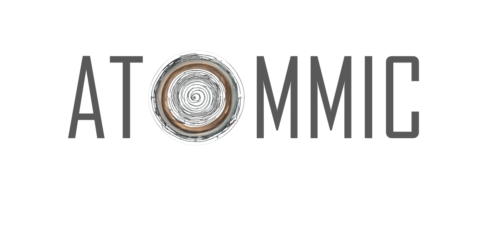

# Advanced Toolbox for Multitask Medical Imaging Consistency (ATOMMIC)
[](https://huggingface.co/wdika)
[](https://github.com/wdika/atommic/issues)
[](https://opensource.org/licenses/Apache-2.0)
[](https://atommic.readthedocs.io/en/latest/?badge=latest)
[](https://badge.fury.io/py/atommic)
[](https://pypi.org/project/atommic/)
[](https://pypi.org/project/atommic/)
[]()
<p align="center">
    
</p>

# 👋 Introduction

The [Advanced Toolbox for Multitask Medical Imaging Consistency (ATOMMIC)](https://github.com/wdika/atommic) is a
toolbox for applying AI methods for **accelerated MRI reconstruction (REC)**, **MRI segmentation (SEG)**,
**quantitative MR imaging (qMRI)**, as well as **multitask learning (MTL)**, i.e., performing multiple tasks
simultaneously, such as reconstruction and segmentation. Each task is implemented in a separate collection, which
consists of data loaders, transformations, models, metrics, and losses. **ATOMMIC** is designed to be modular and
extensible, and it is easy to add new tasks, models, and datasets. **ATOMMIC** uses
[PyTorch Lightning](https://www.pytorchlightning.ai/) for feasible high-performance multi-GPU/multi-node
mixed-precision training.


The schematic overview of **ATOMMIC** showcases the main components of the toolbox. First, we need an [MRI Dataset](README.md#mri-datasets) (e.g., **CC359**). Next, we need to define the high-level parameters, such as the [task and the model](https://atommic.readthedocs.io/en/latest/mri/collections.html), the [undersampling](https://atommic.readthedocs.io/en/latest/mri//undersampling.html), the [transforms](https://atommic.readthedocs.io/en/latest/mri//transforms.html), the [optimizer](https://atommic.readthedocs.io/en/latest/core/core.html#optimization), the [scheduler](https://atommic.readthedocs.io/en/latest/core/core.html#learning-rate-schedulers), the [loss](https://atommic.readthedocs.io/en/latest/mri/losses.html), the [trainer parameters](https://atommic.readthedocs.io/en/latest/core/core.html#training), and the [experiment manager](https://atommic.readthedocs.io/en/latest/core/exp_manager.html). All these parameters are defined in a `.yaml` file using [Hydra](https://hydra.cc/) and [OmegaConf](https://omegaconf.readthedocs.io/).

The trained model is an `.atommic` [module](https://atommic.readthedocs.io/en/latest/core/export.html), exported with [ONNX](https://onnx.ai/) and [TorchScript](https://pytorch.org/docs/stable/jit.html) support, which can be used for inference. The `.atommic` module can also be uploaded on [HuggingFace](https://huggingface.co/). Pretrained models are available on our [HF](https://huggingface.co/wdika) account and can be downloaded and used for inference.

## 🚀 Quick Start Guide

The best way to get started with ATOMMIC is to start with one of the [tutorials](https://atommic.readthedocs.io/en/latest/starthere/tutorials.html):

- [ATOMMIC Primer](https://github.com/wdika/atommic/blob/main/tutorials/00_ATOMMIC_Primer.ipynb) - demonstrates how to use ATOMMIC.
- [ATOMMIC MRI transforms](https://github.com/wdika/atommic/blob/main/tutorials/01_ATOMMIC_MRI_transforms.ipynb) - demonstrates how to use ATOMMIC to undersample MRI data.
- [ATOMMIC MRI undersampling](https://github.com/wdika/atommic/blob/main/tutorials/02_ATOMMIC_MRI_undersampling.ipynb) - demonstrates how to use ATOMMIC to apply transforms to MRI data.
- [ATOMMIC Upload Model on HuggingFace](https://github.com/wdika/atommic/blob/main/tutorials/03_ATOMMIC_Upload_Model_On_HF.ipynb) - demonstrates how to upload a model on HuggingFace.

You can also check the [projects](https://github.com/wdika/atommic/tree/main/projects) page to see how to use ATOMMIC for specific tasks and public datasets.

### **ATOMMIC paper is fully reproducible. Please check [here](https://github.com/wdika/atommic/tree/main/projects/ATOMMIC_paper/README.md) for more information.**

## 🤖 Training & Testing

Training and testing models in **ATOMMIC** is intuitive and easy. You just need to properly configure the `.yaml`
file and just run the following command:

```bash
atommic run -c path-to-config-file
```

## ⚙️ Configuration

1. Choose the **task** and the **model**, according to the [collections](https://atommic.readthedocs.io/en/latest/mri/collections.html).

2. Choose the **dataset** and the **dataset parameters**, according to the [datasets](README.md#mri-datasets) or your own dataset.

3. Choose the [undersampling](https://atommic.readthedocs.io/en/latest/mri/transforms.html).

4. Choose the [transforms](https://atommic.readthedocs.io/en/latest/mri/transforms.html).

5. Choose the [losses](https://atommic.readthedocs.io/en/latest/mri/losses.html).

6. Choose the [optimizer](https://atommic.readthedocs.io/en/latest/core/core.html#optimization).

7. Choose the [scheduler](https://atommic.readthedocs.io/en/latest/core/core.html#learning-rate-schedulers).

8. Choose the [trainer parameters](https://atommic.readthedocs.io/en/latest/core/core.html#training).

9. Choose the [experiment manager](https://atommic.readthedocs.io/en/latest/core/exp_manager.html).

You can also check the [projects](https://github.com/wdika/atommic/tree/main/projects/) page to see how to configure the `.yaml` file for specific tasks.

## 🗂️ Collections

**ATOMMIC** is organized into [collections](https://atommic.readthedocs.io/en/latest/mri/collections.html), each of which implements a specific task. The following collections are currently available, implementing various models as listed:

### MultiTask Learning (MTL)
1. End-to-End Recurrent Attention Network (`SERANet`), 2. Image domain Deep Structured Low-Rank Network (`IDSLR`), 3. Image domain Deep Structured Low-Rank UNet (`IDSLRUNet`), 4. Multi-Task Learning for MRI Reconstruction and Segmentation (`MTLRS`), 5. Reconstruction Segmentation method using UNet (`RecSegUNet`), 6. Segmentation Network MRI (`SegNet`).

### Quantitative MR Imaging (qMRI)
1. Quantitative Recurrent Inference Machines (`qRIMBlock`), 2. Quantitative End-to-End Variational Network (`qVarNet`), 3. Quantitative Cascades of Independently Recurrent Inference Machines (`qCIRIM`).

### MRI Reconstruction (REC)
1. Cascades of Independently Recurrent Inference Machines (`CIRIM`), 2. Convolutional Recurrent Neural Networks (`CRNNet`), 3. Deep Cascade of Convolutional Neural Networks (`CascadeNet`), 4. Down-Up Net (`DUNet`), 5. End-to-End Variational Network (`VarNet`), 6. Independently Recurrent Inference Machines (`RIMBlock`), 7. Joint Deep Model-Based MR Image and Coil Sensitivity Reconstruction Network (`JointICNet`), 8. `KIKINet`, 9. Learned Primal-Dual Net (`LPDNet`), 10. Model-based Deep Learning Reconstruction (`MoDL`), 11. `MultiDomainNet`, 12. `ProximalGradient`, 13. Recurrent Inference Machines (`RIMBlock`), 14. Recurrent Variational Network (`RecurrentVarNet`), 15. `UNet`, 16. Variable Splitting Network (`VSNet`), 17. `XPDNet`, 18. Zero-Filled reconstruction (`ZF`).

### MRI Segmentation (SEG)
1. `SegmentationAttentionUNet`, 2. `SegmentationDYNUNet`, 3. `SegmentationLambdaUNet`, 4. `SegmentationUNet`, 5. `Segmentation3DUNet`, 6. `SegmentationUNetR`, 7. `SegmentationVNet`.

## MRI Datasets

**ATOMMIC** supports public datasets, as well as private datasets. The following public datasets are supported natively:

- [AHEAD](https://github.com/wdika/atommic/tree/main/projects/qMRI/AHEAD): Supports the `(qMRI)` and `(REC)` tasks.
- [BraTS 2023 Adult Glioma](https://github.com/wdika/atommic/tree/main/projects/SEG/BraTS2023AdultGlioma): Supports the `(SEG)` task.
- [CC359](https://github.com/wdika/atommic/tree/main/projects/REC/CC359): Supports the `(REC)` task.
- [fastMRI Brains Multicoil](https://github.com/wdika/atommic/tree/main/projects/REC/fastMRIBrainsMulticoil): Supports the `(REC)` task.
- [fastMRI Knees Multicoil](https://github.com/wdika/atommic/tree/main/projects/REC/fastMRIKneesMulticoil): Supports the `(REC)` task.
- [fastMRI Knees Singlecoil](https://github.com/wdika/atommic/tree/main/projects/REC/fastMRIKneesSinglecoil): Supports the `(REC)` task.
- [ISLES 2022 Sub Acute Stroke](https://github.com/wdika/atommic/tree/main/projects/SEG/ISLES2022SubAcuteStroke): Supports the `(SEG)` task.
- [SKM-TEA](https://github.com/wdika/atommic/tree/main/projects/MTL/rs/SKMTEA): Supports the `(REC)`, `(SEG)`, and `(MTL)` tasks.
- [Stanford Knees](https://github.com/wdika/atommic/tree/main/projects/REC/StanfordKnees2019): Supports the `(REC)` task.

## 🛠️ Installation

**ATOMMIC** is best to be installed in a Conda environment.

### 🐍 Conda
```
conda create -n atommic python=3.10
conda activate atommic
```

### 📦 Pip
Use this installation mode if you want the latest released version.

```bash
pip install atommic
```

### From source

Use this installation mode if you are contributing to atommic.

```bash
git clone https://github.com/wdika/atommic
cd atommic
bash ./reinstall.sh
```

### 🐳 Docker containers
To build an atommic container with Dockerfile from a branch,  please run

```bash
  DOCKER_BUILDKIT=1 docker build -f Dockerfile -t atommic:latest.
```

As [NeMo](https://github.com/NVIDIA/NeMo) suggests, if you choose to work with the `main` branch, use NVIDIA's PyTorch container version [21.05-py3](https://ngc.nvidia.com/containers/nvidia:pytorch/tags), then install from GitHub.

```bash
    docker run --gpus all -it --rm -v <atommic_github_folder>:/ATOMMIC --shm-size=8g \
    -p 8888:8888 -p 6006:6006 --ulimit memlock=-1 --ulimit \
    stack=67108864 --device=/dev/snd nvcr.io/nvidia/pytorch:21.05-py3
```

## 📚 API Documentation

[](https://atommic.readthedocs.io/en/latest/?badge=latest)

Access the API Documentation [here](https://atommic.readthedocs.io/en/latest/index.html)

## 📄 License

**ATOMMIC** is under [](https://opensource.org/licenses/Apache-2.0)


## 📖 Citation

If you use ATOMMIC in your research, please cite as follows:

```BibTeX
@misc{atommic,
    author = {Karkalousos Dimitrios, Isqum Ivana, Marquering Henk, Caan Matthan},
    title = {ATOMMIC: Advanced Toolbox for Multitask Medical Imaging Consistency},
    year = {2023},
    url = {https://github.com/wdika/atommic},
}
```

## 🔗 References

The following papers have used ATOMMIC:

1. Karkalousos, D., Isgum, I., Marquering, H. &amp; Caan, M.W.A.. (2024). MultiTask Learning for accelerated-MRI Reconstruction and Segmentation of Brain Lesions in Multiple Sclerosis. <i>Medical Imaging with Deep Learning</i>, in <i>Proceedings of Machine Learning Research</i> 227:991-1005 Available from https://proceedings.mlr.press/v227/karkalousos24a.html.

2. Zhang, C., Karkalousos, D., Bazin, P. L., Coolen, B. F., Vrenken, H., Sonke, J. J., Forstmann, B. U., Poot, D. H. J., & Caan, M. W. A. (2022). A unified model for reconstruction and R2* mapping of accelerated 7T data using the quantitative recurrent inference machine. NeuroImage, 264. [DOI](https://doi.org/10.1016/j.neuroimage.2022.119680)

3. Karkalousos, D., Noteboom, S., Hulst, H. E., Vos, F. M., & Caan, M. W. A. (2022). Assessment of data consistency through cascades of independently recurrent inference machines for fast and robust accelerated MRI reconstruction. Physics in Medicine & Biology. [DOI](https://doi.org/10.1088/1361-6560/AC6CC2)

## 📧 Contact

For any questions, please contact Dimitris Karkalousos @ [d.karkalousos@amsterdamumc.nl](mailto:d.karkalousos@amsterdamumc.nl).

## ⚠️🙏 Disclaimer & Acknowledgements

> **Note:** ATOMMIC is built on top of [NeMo](https://github.com/NVIDIA/NeMo). NeMo is under Apache 2.0 license, so we are allowed to use it. We also assume that it is allowed to use the NeMo documentation, as long as we cite it and we always refer to the baselines everywhere and in the code and docs. ATOMMIC also includes implementations of reconstruction methods from [fastMRI](https://github.com/facebookresearch/fastMRI) and [DIRECT](https://github.com/NKI-AI/direct), and segmentation methods from [MONAI](https://github.com/Project-MONAI/MONAI), as well as other codebases which are always cited on the corresponding files. All methods in ATOMMIC are reimplemented and not called from the original libraries, allowing for full reproducibility, support, and easy extension. ATOMMIC is an open-source project under the Apache 2.0 license.
