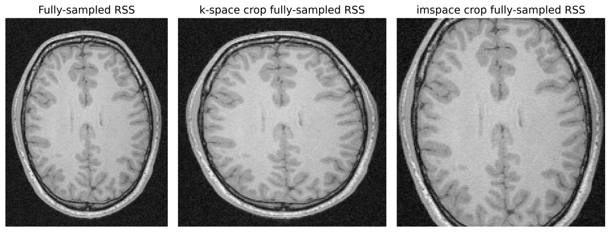
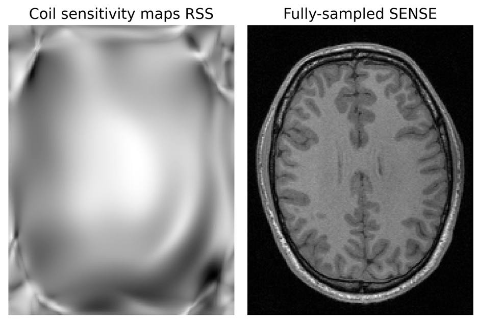
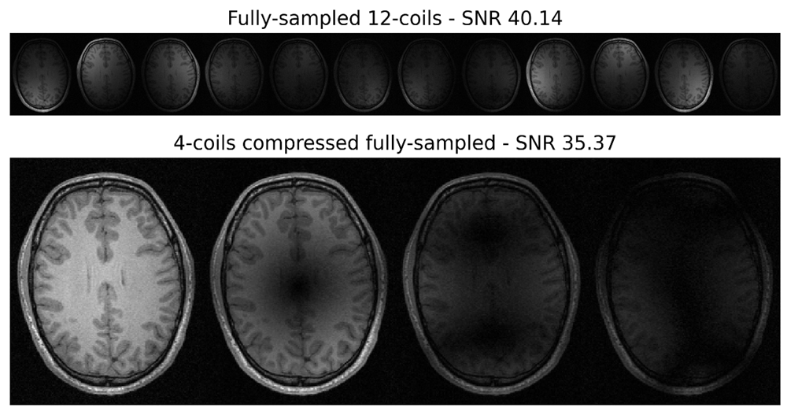
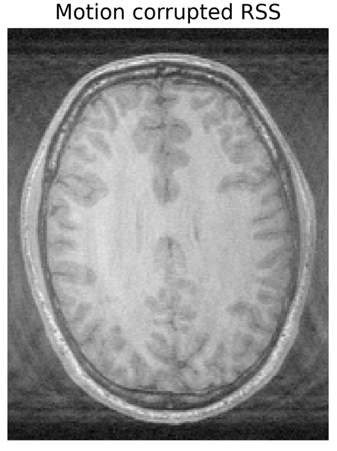
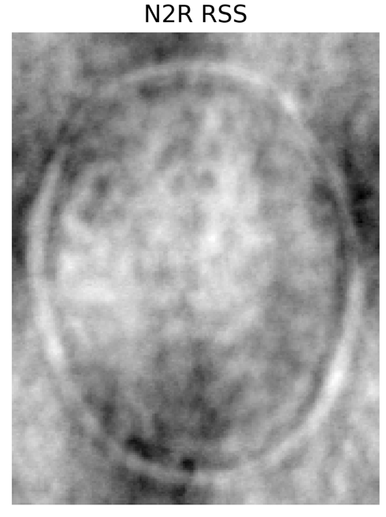
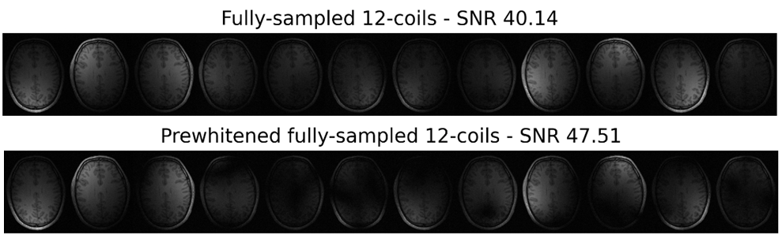
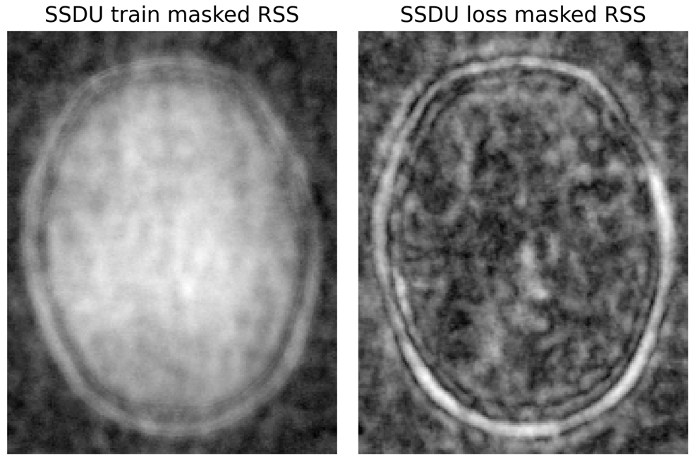
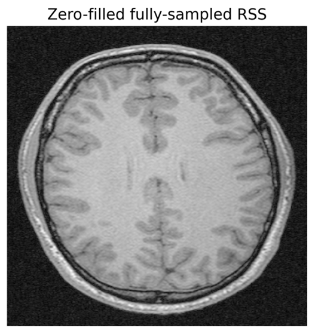

Pre-processing
==============

The following classes for pre-processing MRI data are available:

:class:`~atommic.collections.common.parts.transforms.Cropper`
~~~~~~~~~~~~~~~~~~~~~~~~~~~~~~~~~~~~~~~~~~~~~~~~~~~~~~~~~~~~~
The ``Cropper`` class is used to crop MRI data. Cropping can be performed either in image space or k-space.

.. note::
    If you crop in k-space, data need to be complex-valued as well as that you change the Field-of-View (FOV) of the
    data. If you crop in image space, the FOV remains the same.

Cropping is configurable via YAML with Hydra. For example:

.. code-block:: bash

    train_ds:
        crop_size: [320, 320]
        kspace_crop: false
        crop_before_masking: true

    validation_ds:
        crop_size: [320, 320]
        kspace_crop: true
        crop_before_masking: true

    test_ds:
        crop_size: [320, 320]
        kspace_crop: false
        crop_before_masking: false

The ``crop_size`` parameter is the size of the crop. The ``kspace_crop`` parameter determines whether the crop is
performed in k-space or image space. The ``crop_before_masking`` parameter determines whether the crop is performed
before or after the mask is applied. If the crop is performed before the mask is applied, the mask is applied to the
cropped data. If the crop is performed after the mask is applied, the mask is applied to the uncropped data and then
the crop is performed.

.. note::
    If you crop after the data is masked, the relative acceleration factor of the data will effectively change.

Here is an example on the `CC359 <../starthere/projects/reconstruction/cc359.html>`_ dataset. The fully-sampled data
(first image) are cropped in k-space (second image) and in image space (third image). Images are presented as the
coil-combined Root-Sum-of-Squares (:func:`~atommic.collections.common.parts.utils.rss`).

:class:`~atommic.collections.common.parts.transforms.EstimateCoilSensitivityMaps`
~~~~~~~~~~~~~~~~~~~~~~~~~~~~~~~~~~~~~~~~~~~~~~~~~~~~~~~~~~~~~~~~~~~~~~~~~~~~~~~~~
The ``EstimateCoilSensitivityMaps`` class is used to estimate coil sensitivity maps from multi-coil MRI data. This is
useful when no coil sensitivity maps are available. This class estimates the coil sensitivity maps as implemented in
the `DIRECT library <https://github.com/NKI-AI/direct>`_. Three methods are available for estimating coil sensitivity
maps: unit, RSS-estimate, and ESPIRIT. The unit method assumes that the data is single-coil. The RSS-estimate method
estimates the coil sensitivity maps by using the root-sum-of-squares of the autocalibration-signal. The ESPIRIT method
estimates the coil sensitivity maps with the ESPIRIT method [Uecker2014]_.

References
----------
    .. [Uecker2014] Uecker M, Lai P, Murphy MJ, Virtue P, Elad M, Pauly JM, Vasanawala SS, Lustig M. ESPIRiT--an
        eigenvalue approach to autocalibrating parallel MRI: where SENSE meets GRAPPA. Magn Reson Med. 2014
        Mar;71(3):990-1001. doi: 10.1002/mrm.24751. PMID: 23649942; PMCID: PMC4142121.

Estimating coil sensitivity maps is configurable via YAML with Hydra. For example:

.. code-block:: bash

    train_ds:
        estimate_coil_sensitivity_maps: true
        coil_sensitivity_maps_type: rss
        coil_sensitivity_maps_gaussian_sigma: 0.0
        coil_sensitivity_maps_espirit_threshold: 0.05
        coil_sensitivity_maps_espirit_kernel_size: 6
        coil_sensitivity_maps_espirit_crop: 0.95
        coil_sensitivity_maps_espirit_max_iters: 30
        coil_combination_method: SENSE

    validation_ds:
        estimate_coil_sensitivity_maps: true
        coil_sensitivity_maps_type: unit
        coil_sensitivity_maps_gaussian_sigma: 0.0
        coil_sensitivity_maps_espirit_threshold: 0.05
        coil_sensitivity_maps_espirit_kernel_size: 6
        coil_sensitivity_maps_espirit_crop: 0.95
        coil_sensitivity_maps_espirit_max_iters: 30
        coil_combination_method: SENSE

    test_ds:
        estimate_coil_sensitivity_maps: true
        coil_sensitivity_maps_type: espirit
        coil_sensitivity_maps_gaussian_sigma: 0.0
        coil_sensitivity_maps_espirit_threshold: 0.05
        coil_sensitivity_maps_espirit_kernel_size: 6
        coil_sensitivity_maps_espirit_crop: 0.95
        coil_sensitivity_maps_espirit_max_iters: 30
        coil_combination_method: SENSE

.. note::
    This class is different from setting ``estimate_coil_sensitivity_maps_with_nn`` to ``true`` in the ``model``
    section. The ``EstimateCoilSensitivityMaps`` class estimates coil sensitivity maps from the data, whereas setting
    ``estimate_coil_sensitivity_maps_with_nn`` to ``true`` in the ``model`` section estimates coil sensitivity maps
    with a neural network, i.e. a U-Net. Those two methods are not mutually exclusive and can be used together,
    meaning that the coil sensitivity maps estimated by the ``EstimateCoilSensitivityMaps`` class can be used as input
    to the neural network and refined.

    Estimating/refining coil sensitivity maps with a neural network is configurable via YAML with Hydra. For example:

    .. code-block:: bash

        estimate_coil_sensitivity_maps_with_nn: true
        coil_sensitivity_maps_nn_chans: 8
        coil_sensitivity_maps_nn_pools: 4
        coil_sensitivity_maps_nn_normalize: true
        coil_sensitivity_maps_nn_mask_type: 2D
        coil_sensitivity_maps_nn_mask_center: true

    The ``coil_sensitivity_maps_nn_chans`` parameter is the number of channels in the neural network. The
    ``coil_sensitivity_maps_nn_pools`` parameter is the number of pooling layers in the neural network. The
    ``coil_sensitivity_maps_nn_normalize`` parameter determines whether the data is normalized before being fed into
    the neural network. The ``coil_sensitivity_maps_nn_mask_type`` parameter determines the type of mask that is used
    to mask the data before being fed into the neural network, i.e. 1D or 2D. The
    ``coil_sensitivity_maps_nn_mask_center`` parameter determines whether the center of the mask is used or not. If
    ``coil_sensitivity_maps_nn_mask_center`` is set to ``true``, the center of the mask is used. If
    ``coil_sensitivity_maps_nn_mask_center`` is set to ``false``, the center of the mask is not used. The latter might
    be useful if the center of the mask is corrupted by noise, but it might also lead to worse estimation of the coil
    sensitivity maps.

Here is an example on the `CC359 <../starthere/projects/reconstruction/cc359.html>`_ dataset. The estimated coils
sensitivity maps (first image) are presented as the coil-combined Root-Sum-of-Squares
(:func:`~atommic.collections.common.parts.utils.rss`). The fully-sampled data are coil-combined with the estimated
coil sensitivity maps with the :func:`~atommic.collections.common.parts.utils.sense` method (second image), as
presented in [Pruessmann1999]_.

References
----------
    .. [Pruessmann1999] Pruessmann KP, Weiger M, Scheidegger MB, Boesiger P. SENSE: Sensitivity encoding for fast MRI.
        Magn Reson Med 1999; 42:952-962.

:class:`~atommic.collections.common.parts.transforms.GeometricDecompositionCoilCompression`
~~~~~~~~~~~~~~~~~~~~~~~~~~~~~~~~~~~~~~~~~~~~~~~~~~~~~~~~~~~~~~~~~~~~~~~~~~~~~~~~~~~~~~~~~~~

The ``GeometricDecompositionCoilCompression`` class is used to perform coil compression with the geometric
decomposition method, as presented in [Zhang2013]_.

References
----------
    .. [Zhang2013] Zhang, T., Pauly, J. M., Vasanawala, S. S., & Lustig, M. (2013). Coil compression for accelerated
        imaging with Cartesian sampling. Magnetic Resonance in Medicine, 69(2), 571–582.
        https://doi.org/10.1002/mrm.24267

The ``GeometricDecompositionCoilCompression`` class is configurable via YAML with Hydra. For example:

.. code-block:: bash

    train_ds:
        apply_gcc: true
        gcc_virtual_coils: 10
        gcc_calib_lines: 24
        gcc_align_data: True

    validation_ds:
        apply_gcc: true
        gcc_virtual_coils: 2
        gcc_calib_lines: 12
        gcc_align_data: False

    test_ds:
        apply_gcc: false

The ``apply_gcc`` parameter determines whether coil compression is applied or not. The ``gcc_virtual_coils`` parameter
is the number of virtual coils to compress to. Of course, the number of virtual coils should be smaller than the
number of coils in the data. The ``gcc_calib_lines`` parameter is the number of calibration lines used for coil
compression. The ``gcc_align_data`` parameter determines whether the data is aligned before coil compression or not.

Here is an example on the `CC359 <../starthere/projects/reconstruction/cc359.html>`_ dataset. The fully-sampled
12-coils (first image) are compressed to 4-coils. The SNR in the compressed data is approximately 12% lower than in
the fully-sampled data, but the overall image quality is still good.

:class:`~atommic.collections.motioncorrection.parts.motionsimulation.MotionSimulation`
~~~~~~~~~~~~~~~~~~~~~~~~~~~~~~~~~~~~~~~~~~~~~~~~~~~~~~~~~~~~~~~~~~~~~~~~~~~~~~~~~~~~~~

The ``MotionSimulation`` class is used to simulate motion in MRI data, by simulating random translations and rotations
in the frequency domain.

The ``MotionSimulation`` class is configurable via YAML with Hydra. For example:

.. code-block:: bash

    train_ds:
        apply_random_motion: true
        random_motion_type:"gaussian"
        random_motion_percentage: [10, 30]
        random_motion_angle: 10
        random_motion_translation: 10
        random_motion_center_percentage: 0.02
        random_motion_num_segments: 8
        random_motion_random_num_segments: true
        random_motion_non_uniform: false

    validation_ds:
        apply_random_motion: true
        random_motion_type:"piecewise_transient"
        random_motion_percentage: [10, 20]
        random_motion_angle: 10
        random_motion_translation: 10
        random_motion_center_percentage: 0.02
        random_motion_num_segments: 8
        random_motion_random_num_segments: false
        random_motion_non_uniform: true

    test_ds:
        apply_random_motion: true
        random_motion_type:"piecewise_constant"
        random_motion_percentage: [0, 0]
        random_motion_angle: 10
        random_motion_translation: 10
        random_motion_center_percentage: 0.02
        random_motion_num_segments: 8
        random_motion_random_num_segments: true
        random_motion_non_uniform: false

The ``apply_random_motion`` parameter determines whether random motion is applied or not. The ``random_motion_type``
parameter determines the type of random motion that is applied, it can be ``gaussian``, ``piecewise_constant``, or
``piecewise_transient``. The ``random_motion_percentage`` parameter is the percentage of the data that is affected by
random motion. Setting ``random_motion_percentage`` to ``[0, 0]`` means that no random motion is applied. The
``random_motion_angle`` parameter is the maximum angle of rotation in degrees. The ``random_motion_translation``
parameter is the maximum translation in pixels. The ``random_motion_center_percentage`` parameter is the percentage of
the center of the data to center the motion parameters. The ``random_motion_num_segments`` parameter is the number of
segments to divide the data into. The ``random_motion_random_num_segments`` parameter determines whether the number of
segments is random or not. The ``random_motion_non_uniform`` parameter determines whether the motion parameters are
non-uniform or not.

.. note::
    Please check the `Motion Simulation <../api/motioncorrection/motionsimulation.html>`_ page for more information.

Here is an example on the `CC359 <../starthere/projects/reconstruction/cc359.html>`_ dataset. The motion corrupted
image is presented as the coil-combined Root-Sum-of-Squares (:func:`~atommic.collections.common.parts.utils.rss`).

:class:`~atommic.collections.common.parts.transforms.N2R`
~~~~~~~~~~~~~~~~~~~~~~~~~~~~~~~~~~~~~~~~~~~~~~~~~~~~~~~~~

The ``N2R`` class resembles the Noise-to-Recon method for unsupervised learning of MRI reconstruction [Desai2022]_.

References
----------
    [Desai2022] AD Desai, BM Ozturkler, CM Sandino, et al. Noise2Recon: Enabling Joint MRI Reconstruction and
        Denoising with Semi-Supervised and Self-Supervised Learning. ArXiv 2022. https://arxiv.org/abs/2110.00075

The ``N2R`` class is configurable via YAML with Hydra. For example:

.. code-block:: bash

    train_ds:
        n2r: true
        n2r_supervised_rate: 0.05
        n2r_probability: 0.0
        n2r_std_devs: None
        n2r_rhos: None
        n2r_use_mask: False

    validation_ds:
        n2r: true
        n2r_supervised_rate: 0.0
        n2r_probability: 0.0
        n2r_std_devs: None
        n2r_rhos: None
        n2r_use_mask: False

    test_ds:
        n2r: false

The ``n2r`` parameter determines whether the Noise2Recon method is applied or not. The ``n2r_supervised_rate``
parameter is the rate of supervised samples in the training data. It can be set to ``0.0`` for fully unsupervised
learning or to a small percentage for semi-supervised learning. The ``n2r_probability`` parameter is the probability
of applying the Noise2Recon method to a sample. The ``n2r_std_devs`` parameter is the standard deviation of the
Gaussian noise that is added to the data. The ``n2r_rhos`` parameter is the correlation coefficient of the Gaussian
noise that is added to the data. The ``n2r_use_mask`` parameter determines whether the mask is applied to the data
before the Noise2Recon method is applied or not. If ``n2r_use_mask`` is set to ``True``, the mask is applied to the
data before the Noise2Recon method is applied. If ``n2r_use_mask`` is set to ``False``, the mask is not applied to the
data before the Noise2Recon method is applied.

The ``N2R`` class can be used in combination with the ``unsupervised_masked_target`` argument of the dataloaders.
If ``unsupervised_masked_target`` is set to ``True``, the target is masked before the Noise2Recon method is applied.
If ``unsupervised_masked_target`` is set to ``False``, the target is not masked before the Noise2Recon method is
applied.

Here is an example on the `CC359 <../starthere/projects/reconstruction/cc359.html>`_ dataset. The N2R image is
presented as the coil-combined Root-Sum-of-Squares (:func:`~atommic.collections.common.parts.utils.rss`).

:class:`~atommic.collections.common.parts.transforms.NoisePreWhitening`
~~~~~~~~~~~~~~~~~~~~~~~~~~~~~~~~~~~~~~~~~~~~~~~~~~~~~~~~~~~~~~~~~~~~~~~

The ``NoisePreWhitening`` class is used to perform noise pre-whitening/coil-decorrelation. This is useful when the
noise is uncorrelated, i.e. non iid.

The ``NoisePreWhitening`` class is configurable via YAML with Hydra. For example:

.. code-block:: bash

    train_ds:
        apply_prewhitening: true
        find_patch_size: true
        prewhitening_scale_factor: 1.0

    validation_ds:
        apply_prewhitening: true
        find_patch_size: false
        prewhitening_scale_factor: 0.8
        prewhitening_patch_start: 10
        prewhitening_patch_length: 30

    test_ds:
        apply_prewhitening: false

The ``apply_prewhitening`` parameter determines whether noise pre-whitening is applied or not. The ``find_patch_size``
parameter determines whether the patch size is found automatically or not. If ``find_patch_size`` is set to ``False``,
the patch size is set manually with the ``prewhitening_patch_start`` and ``prewhitening_patch_length`` parameters, as
``[prewhitening_patch_start, prewhitening_patch_start + prewhitening_patch_length, prewhitening_patch_start,
prewhitening_patch_start + prewhitening_patch_length]``. The ``scale_factor`` parameter is used to adjust for
effective noise bandwidth and difference in sampling rate between noise calibration and actual measurement. It is
given by :math:`scale\_factor = \frac{T\_acq\_dwell}{T\_noise\_dwell} \cdot NoiseReceiverBandwidthRatio` .

Here is an example on the `CC359 <../starthere/projects/reconstruction/cc359.html>`_ dataset. The fully-sampled
12-coils (first image) are noise pre-whitened (second image). The SNR in the pre-whitened data is approximately
18% higher than in the fully-sampled data.

:class:`~atommic.collections.common.parts.transforms.Normalizer`
~~~~~~~~~~~~~~~~~~~~~~~~~~~~~~~~~~~~~~~~~~~~~~~~~~~~~~~~~~~~~~~~

The ``Normalizer`` class is used to normalize MRI data. The following normalization methods are available:

- ``minmax``: Data are normalized as :math:`\frac{data - \min(data)}{\max(data) - \min(data)}` to [0, 1].
- ``max``: data are normalized as :math:`\frac{data}{\max(data)}` to [0, 1].
- ``mean_std``: data are normalized as :math:`\frac{data - mean(data)}{std(data)}`.
- ``mean_var``: data are normalized as :math:`\frac{data - mean(data)}{var(data)}`.
- ``grayscale``: data are normalized as :math:`\frac{data - \min(data)}{\max(data) - \min(data)} \cdot 255` to [0, 255].
- ``fft``: only the default ``fft_normalization`` will be applied, i.e. ``backward``. It is basically the same as
  ``none``.
- ``none``.

The ``Normalizer`` class is configurable via YAML with Hydra. For example:

.. code-block:: bash

    train_ds:
        normalize_inputs: true
        normalization_type: minmax
        kspace_normalization: false

    validation_ds:
        normalize_inputs: true
        normalization_type: minmax
        kspace_normalization: true

    test_ds:
        normalize_inputs: false

The ``normalize_inputs`` parameter determines whether the inputs are normalized or not. The ``normalization_type``
parameter determines the normalization method. The ``kspace_normalization`` parameter determines whether the
normalization is performed in k-space or image space.

The following arguments in the ``model`` section of the YAML config file are also related to normalization:

- ``normalization_type``: determines the normalization type as above.
- ``unnormalize_loss_inputs``: if data are normalized, you can choose to unnormalize them before calculating the loss.
- ``unnormalize_log_outputs``: if data are normalized, you can choose to unnormalize them before logging metrics.

:class:`~atommic.collections.common.parts.transforms.SNREstimator`
~~~~~~~~~~~~~~~~~~~~~~~~~~~~~~~~~~~~~~~~~~~~~~~~~~~~~~~~~~~~~~~~~~

The ``SNREstimator`` class is used to estimate the SNR of MRI data. The SNR is using the
:class:`skimage.filters.threshold_otsu` and the :class:`skimage.morphology.convex_hull_image` functions to estimate
the signal. The noise is estimated in k-space by defining as patch, as in ``NoisePreWhitening``. The SNR is then
calculated as the ratio of the signal and the noise.

The ``SNREstimator`` class is configurable via YAML with Hydra. For example:

.. code-block:: bash

    patch_size: [10, 30, 10, 30]
    apply_ifft: true
    fft_centered: false
    fft_normalization: "backward"
    spatial_dims: [-2, -1]
    coil_dim: -3
    multicoil: true

The ``patch_size`` parameter is the size of the patch that is used to estimate the noise. The ``apply_ifft`` parameter
determines whether the inverse Fourier transform is applied to the data before estimating the noise or not. The
``fft_centered`` parameter determines whether the Fourier transform is centered or not. The ``fft_normalization``
parameter determines the normalization of the Fourier transform. The ``spatial_dims`` parameter determines the spatial
dimensions of the data. The ``coil_dim`` parameter determines the coil dimension of the data. The ``multicoil``
parameter determines whether the data is multi-coil or not.

.. note::
    The ``SNREstimator`` class is currently not a transform you can compose. You can call it in external scripts to
    estimate the SNR of your data, or configure it in your own transform.

:class:`~atommic.collections.common.parts.transforms.SSDU`
~~~~~~~~~~~~~~~~~~~~~~~~~~~~~~~~~~~~~~~~~~~~~~~~~~~~~~~~~~

The ``SSDU`` class resembles the Self-Supervised Data Undersampling method for unsupervised learning of MRI
reconstruction [Yaman2020]_.

References
----------
    [Yaman2020] Yaman, B, Hosseini, SAH, Moeller, S, Ellermann, J, Uğurbil, K, Akçakaya, M. Self-supervised learning
        of physics-guided reconstruction neural networks without fully sampled reference data. Magn Reson Med. 2020;
        84: 3172–3191. https://doi.org/10.1002/mrm.28378

The ``SSDU`` class is configurable via YAML with Hydra. For example:

.. code-block:: bash

    train_ds:
        ssdu: true
        ssdu_mask_type: "Gaussian"
        ssdu_rho: 0.4
        ssdu_acs_block_size: [4, 4]
        ssdu_gaussian_std_scaling_factor: 4.0
        ssdu_outer_kspace_fraction: 0.0
        ssdu_export_and_reuse_masks: false

    validation_ds:
        ssdu: true
        ssdu_mask_type: "Uniform"
        ssdu_rho: 0.4
        ssdu_acs_block_size: [4, 4]
        ssdu_gaussian_std_scaling_factor: 4.0
        ssdu_outer_kspace_fraction: 0.0
        ssdu_export_and_reuse_masks: true

    test_ds:
        ssdu: false

The ``ssdu`` parameter determines whether the Self-Supervised Data Undersampling method is applied or not. The
``ssdu_mask_type`` parameter determines the type of mask that is used to undersample the data. The ``ssdu_rho``
parameter is the split ratio for training and loss masks. The ``ssdu_acs_block_size`` parameter keeps a small acs
region fully-sampled for training masks, if there is no fully-sampled acs region. The ``ssdu_acs_block_size`` should
be set to zero. The ``ssdu_gaussian_std_scaling_factor`` parameter is the scaling factor for the standard deviation
of the Gaussian mask. The ``ssdu_outer_kspace_fraction`` parameter is the fraction of outer k-space lines that are
masked. The ``ssdu_export_and_reuse_masks`` parameter determines whether the masks are exported and reused or not. If
``ssdu_export_and_reuse_masks`` is set to ``True``, the masks are exported to the ``tmp`` directory and reused in the
next call. This option is useful when the data are too large to be stored in memory.

.. note::
    ``SSDU`` can be used with ``N2R`` as described in the Noise-to-Recon paper [Desai2022]_.

Here is an example on the `CC359 <../starthere/projects/reconstruction/cc359.html>`_ dataset. SSDU returns two masks,
one to be used as mask for training (first image) and one to be used as mask against which the loss is calculated
(second image). The presented SSDU images are the inputs where the mask is applied, computed as the coil-combined
Root-Sum-of-Squares (:func:`~atommic.collections.common.parts.utils.rss`).

:class:`~atommic.collections.common.parts.transforms.ZeroFillingPadding`
~~~~~~~~~~~~~~~~~~~~~~~~~~~~~~~~~~~~~~~~~~~~~~~~~~~~~~~~~~~~~~~~~~~~~~~~

The ``ZeroFillingPadding`` class is used to pad MRI data in k-space, i.e. enlarge the Field-of-View (FOV) of the data.
This is useful when the data are undersampled and the FOV needs to be enlarged to match the FOV of the fully-sampled
data.

The ``ZeroFillingPadding`` class is configurable via YAML with Hydra. For example:

.. code-block:: bash

    train_ds:
        kspace_zero_filling_size: [640, 640]

    validation_ds:
        kspace_zero_filling_size: [640, 640]

    test_ds:
        kspace_zero_filling_size: None

The ``kspace_zero_filling_size`` parameter is the size of the zero-filled k-space. If ``kspace_zero_filling_size`` is
set to ``None``, no zero-filling is performed.

Here is an example on the `CC359 <../starthere/projects/reconstruction/cc359.html>`_ dataset. The zero-filled padded
image is presented as the coil-combined Root-Sum-of-Squares (:func:`~atommic.collections.common.parts.utils.rss`).

:class:`~atommic.collections.common.parts.transforms.Composer`
~~~~~~~~~~~~~~~~~~~~~~~~~~~~~~~~~~~~~~~~~~~~~~~~~~~~~~~~~~~~~~
The ``Composer`` class is used to compose a series of transforms into a single transform. No configuration is required
for this class.

Here is an example on the `CC359 <../starthere/projects/reconstruction/cc359.html>`_ dataset. The fully-sampled
12-coils (first image) are compressed to 4-coils and noise pre-whitened (second image), as a composed transform.
The SNR in the pre-whitened data is approximately 8% lower than in the fully-sampled data, showing the apparent
improvement of noise pre-whitening compared to the 12% loss in the standalone Geometric Decomposition Coil Compression
method.

.. image:: ../../assets/gdccpw.png
    :align: center
    :width: 100%

:class:`~atommic.collections.common.parts.transforms.MRIDataTransforms`
~~~~~~~~~~~~~~~~~~~~~~~~~~~~~~~~~~~~~~~~~~~~~~~~~~~~~~~~~~~~~~~~~~~~~~~

The ``MRIDataTransforms`` class is used to compose the transforms that are applied to the MRI data. All the
aforementioned transforms are composed in this class. The ``MRIDataTransforms`` class is configurable via YAML with
Hydra. A few other parameters are also important and should be set in the ``train_ds``, ``validation_ds``, and
``test_ds`` sections of the YAML config file. For example:

.. code-block:: bash

    # dataset-related parameters
    dataset_format: None
    dimensionality: 2
    consecutive_slices: 1
    # fft-related parameters
    fft_centered: false
    fft_normalization: "backward"
    spatial_dims: [-2, -1]
    coil_dim: 1
    # undersampling-related parameters
    mask_func: None
    shift_mask: false
    mask_center_scale: 0.02
    partial_fourier_percentage: 0.0
    remask: false
    # dataloader-related parameters
    use_seed: false

The ``dataset_format`` parameter is the format of the dataset. The ``dimensionality`` parameter is the dimensionality
of the data, i.e. ``2`` for 2D data and ``3`` for 3D data. The ``consecutive_slices`` parameter is the number of
consecutive slices that are used as input. If set to ``1``, only one slice is used as input. If set to ``2`` or more,
the number of slices is increased by one for each additional consecutive slice. The ``coil_dim`` parameter determines
the coil dimension of the data.

.. note::
    Please check the `multitasking <../starthere/projects/multitask/intro.html>`_,
    `qMRI <../starthere/projects/quantitative/intro.html>`_,
    `reconstruction <../starthere/projects/reconstruction/intro.html>`_, and
    `segmentation <../starthere/projects/segmentation/intro.html>`_ projects pages for information about the supported
    public datasets.

The ``fft_centered`` parameter determines whether the Fourier transform is centered or
not. The ``fft_normalization`` parameter determines the normalization of the Fourier transform. The ``spatial_dims``
parameter determines the spatial dimensions of the data.

.. note::
    Please check the `FFT <../api/common/fft.html>`_ page for more information.

The ``mask_func`` parameter is the mask function that is used to undersample the data. The ``shift_mask``
parameter determines whether the mask is shifted or not. The ``mask_center_scale`` parameter is the scale of the mask
center. The ``partial_fourier_percentage`` parameter is the percentage of the data that is undersampled. The
``remask`` parameter determines whether the data is remasked or not. The ``use_seed`` parameter determines whether a
seed is used or not.

:class:`~atommic.collections.quantitative.parts.transforms.qMRIDataTransforms`
~~~~~~~~~~~~~~~~~~~~~~~~~~~~~~~~~~~~~~~~~~~~~~~~~~~~~~~~~~~~~~~~~~~~~~~~~~~~~~

Inheriting from the ``MRIDataTransforms`` class, the ``qMRIDataTransforms`` class is used to compose the transforms
that are applied to the MRI data for the quantitative task. A few other parameters are also important and should be
set in the ``train_ds``, ``validation_ds``, and ``test_ds`` sections of the YAML config file. For example:

.. code-block:: bash

    # dataset-related parameters
    TEs: None
    precompute_quantitative_maps: true
    qmaps_scaling_factor: 1.0
    shift_B0_input: false

The ``TEs`` parameter is the echo times of the data. The ``precompute_quantitative_maps`` parameter determines whether
the quantitative maps are precomputed or not. If not precomputed, the quantitative maps are computed on the fly. The
``qmaps_scaling_factor`` parameter is the scaling factor of the quantitative maps. The ``shift_B0_input`` parameter
determines whether the B0 map is shifted or not.

:class:`~atommic.collections.multitask.rs.parts.transforms.RSMRIDataTransforms`
~~~~~~~~~~~~~~~~~~~~~~~~~~~~~~~~~~~~~~~~~~~~~~~~~~~~~~~~~~~~~~~~~~~~~~~~~~~~~~~

Inheriting from the ``MRIDataTransforms`` class, the ``RSMRIDataTransforms`` class is used to compose the transforms
that are applied to the MRI data for the reconstruction and segmentation tasks.

:class:`~atommic.collections.reconstruction.parts.transforms.ReconstructionMRIDataTransforms`
~~~~~~~~~~~~~~~~~~~~~~~~~~~~~~~~~~~~~~~~~~~~~~~~~~~~~~~~~~~~~~~~~~~~~~~~~~~~~~~~~~~~~~~~~~~~~

Inheriting from the ``MRIDataTransforms`` class, the ``ReconstructionMRIDataTransforms`` class is used to compose the
transforms that are applied to the MRI data for the reconstruction task.

:class:`~atommic.collections.segmentation.parts.transforms.SegmentationMRIDataTransforms`
~~~~~~~~~~~~~~~~~~~~~~~~~~~~~~~~~~~~~~~~~~~~~~~~~~~~~~~~~~~~~~~~~~~~~~~~~~~~~~~~~~~~~~~~~

Inheriting from the ``MRIDataTransforms`` class, the ``SegmentationMRIDataTransforms`` class is used to compose the
transforms that are applied to the MRI data for the segmentation task.

Full Example
============

Here is a full training example of a YAML config file for the reconstruction task on the
`CC359 <../starthere/projects/reconstruction/cc359.html>`_ dataset:

.. code-block:: bash

    train_ds:
        # dataset-related parameters
        data_path: /calgary-campinas_version-1.0/CC359/Raw-data/Multi-channel/12-channel/Train
        coil_sensitivity_maps_path: None
        mask_path: /calgary-campinas_version-1.0/CC359/poisson_sampling_h5/Train
        noise_path: None
        initial_predictions_path: None
        dataset_format: cc359
        dimensionality: 2
        consecutive_slices: 1
        complex_target: true
        # sample rate parameters
        sample_rate: 1
        volume_sample_rate: None
        use_dataset_cache: false
        dataset_cache_file: None
        num_cols: None
        # dataloader-related parameters
        data_saved_per_slice: false
        use_seed: false
        batch_size: 1
        shuffle: true
        num_workers: 8
        pin_memory: false
        drop_last: false
        # * Transforms *
        # fft-related parameters
        fft_centered: false
        fft_normalization: "backward"
        spatial_dims: [-2, -1]
        coil_dim: 1
        # coil compression parameters
        apply_gcc: true
        gcc_virtual_coils: 10
        gcc_calib_lines: 24
        gcc_align_data: True
        # coil sensitivity maps parameters
        estimate_coil_sensitivity_maps: true
        coil_sensitivity_maps_type: rss
        coil_sensitivity_maps_gaussian_sigma: 0.0
        coil_sensitivity_maps_espirit_threshold: 0.05
        coil_sensitivity_maps_espirit_kernel_size: 6
        coil_sensitivity_maps_espirit_crop: 0.95
        coil_sensitivity_maps_espirit_max_iters: 30
        coil_combination_method: SENSE
        # cropping parameters
        crop_size: [200, 200]
        kspace_crop: false
        crop_before_masking: true
        # motion simulation parameters
        apply_random_motion: true
        random_motion_type:"gaussian"
        random_motion_percentage: [10, 30]
        random_motion_angle: 10
        random_motion_translation: 10
        random_motion_center_percentage: 0.02
        random_motion_num_segments: 8
        random_motion_random_num_segments: true
        random_motion_non_uniform: false
        # noise-2-recon parameters
        n2r: true
        n2r_supervised_rate: 0.05
        n2r_probability: 0.0
        n2r_std_devs: None
        n2r_rhos: None
        n2r_use_mask: False
        # noise pre-whitening parameters
        apply_prewhitening: true
        find_patch_size: true
        prewhitening_scale_factor: 1.0
        # normalization parameters
        normalize_inputs: true
        normalization_type: minmax
        kspace_normalization: false
        # self-supervised data undersampling parameters
        ssdu: true
        ssdu_mask_type: "Gaussian"
        ssdu_rho: 0.4
        ssdu_acs_block_size: [4, 4]
        ssdu_gaussian_std_scaling_factor: 4.0
        ssdu_outer_kspace_fraction: 0.0
        ssdu_export_and_reuse_masks: false
        # zero-filling padding parameters
        kspace_zero_filling_size: [320, 320]
        # undersampling-related parameters
        mask_func: None
        shift_mask: false
        mask_center_scale: 0.02
        partial_fourier_percentage: 0.0
        remask: false

    validation_ds:
        # dataset-related parameters
        data_path: /calgary-campinas_version-1.0/CC359/Raw-data/Multi-channel/12-channel/Val
        coil_sensitivity_maps_path: None
        mask_path: /calgary-campinas_version-1.0/CC359/poisson_sampling_h5/Val
        noise_path: None
        initial_predictions_path: None
        dataset_format: cc359
        dimensionality: 2
        consecutive_slices: 1
        complex_target: true
        # sample rate parameters
        sample_rate: 1
        volume_sample_rate: None
        use_dataset_cache: false
        dataset_cache_file: None
        num_cols: None
        # dataloader-related parameters
        data_saved_per_slice: false
        use_seed: true
        batch_size: 1
        shuffle: true
        num_workers: 8
        pin_memory: false
        drop_last: false
        # * Transforms *
        # fft-related parameters
        fft_centered: false
        fft_normalization: "backward"
        spatial_dims: [-2, -1]
        coil_dim: 1
        # coil compression parameters
        apply_gcc: true
        gcc_virtual_coils: 10
        gcc_calib_lines: 24
        gcc_align_data: True
        # coil sensitivity maps parameters
        estimate_coil_sensitivity_maps: true
        coil_sensitivity_maps_type: rss
        coil_sensitivity_maps_gaussian_sigma: 0.0
        coil_sensitivity_maps_espirit_threshold: 0.05
        coil_sensitivity_maps_espirit_kernel_size: 6
        coil_sensitivity_maps_espirit_crop: 0.95
        coil_sensitivity_maps_espirit_max_iters: 30
        coil_combination_method: SENSE
        # cropping parameters
        crop_size: [200, 200]
        kspace_crop: false
        crop_before_masking: true
        # motion simulation parameters
        apply_random_motion: true
        random_motion_type:"gaussian"
        random_motion_percentage: [10, 30]
        random_motion_angle: 10
        random_motion_translation: 10
        random_motion_center_percentage: 0.02
        random_motion_num_segments: 8
        random_motion_random_num_segments: true
        random_motion_non_uniform: false
        # noise-2-recon parameters
        n2r: true
        n2r_supervised_rate: 0.05
        n2r_probability: 0.0
        n2r_std_devs: None
        n2r_rhos: None
        n2r_use_mask: False
        # noise pre-whitening parameters
        apply_prewhitening: true
        find_patch_size: true
        prewhitening_scale_factor: 1.0
        # normalization parameters
        normalize_inputs: true
        normalization_type: minmax
        kspace_normalization: false
        # self-supervised data undersampling parameters
        ssdu: true
        ssdu_mask_type: "Gaussian"
        ssdu_rho: 0.4
        ssdu_acs_block_size: [4, 4]
        ssdu_gaussian_std_scaling_factor: 4.0
        ssdu_outer_kspace_fraction: 0.0
        ssdu_export_and_reuse_masks: false
        # zero-filling padding parameters
        kspace_zero_filling_size: [320, 320]
        # undersampling-related parameters
        mask_func: None
        shift_mask: false
        mask_center_scale: 0.02
        partial_fourier_percentage: 0.0
        remask: false
