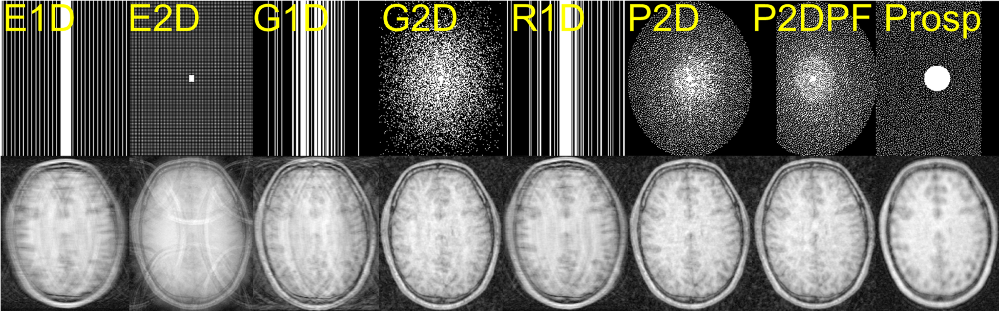

Undersampling
=============

Data undersampling or subsampling is a common technique in MRI to reduce the amount of data acquired or in other words
to accelerate the acquisition process. This is achieved by reducing the number of k-space lines acquired. The missing
k-space lines are then estimated using different techniques.

The forward model of accelerated MRI is given by :math:`y = P F x + n`, where :math:`y` is the acquired data,
:math:`x` is the image, :math:`F` is the FFT operator, :math:`P` is the undersampling operator and :math:`n` is the
noise from the acquisition process.

:math:`P` can either applied prospectively or retrospectively. In prospective undersampling, the k-space is
undersampled in the scanner, during the acquisition process. In retrospective undersampling, the k-space is
undersampled after the acquisition process, meaning that we acquire fully sampled k-space and then we apply the
undersampling operator to the acquired data.

``ATOMMIC`` can handle both prospective and retrospective undersampling via the ``mask_args`` of the
``train_ds``, ``validation_ds`` and ``test_ds`` functions. The ``mask_args`` is a dictionary that contains
the following keys:

- ``type``:
    The type of the undersampling mask. It can be one of the following
    :class:`~atommic.collections.common.data.subsample.Equispaced1DMaskFunc`,
    :class:`~atommic.collections.common.data.subsample.Equispaced2DMaskFunc`,
    :class:`~atommic.collections.common.data.subsample.Gaussian1DMaskFunc`,
    :class:`~atommic.collections.common.data.subsample.Gaussian2DMaskFunc`,
    :class:`~atommic.collections.common.data.subsample.Poisson2DMaskFunc`,
    :class:`~atommic.collections.common.data.subsample.Random1DMaskFunc`, or ``none`` (no undersampling).
- ``accelerations``:
    The acceleration factors to be used. It can be a list of integers or a single integer. If it is a list of
    integers, then the undersampling mask is randomly selected from the list. If it is a single integer, then the
    undersampling mask is randomly selected from the list of acceleration factors that are less than or equal to the
    given integer. For example, if ``accelerations`` is ``[4, 8, 12]``, then the undersampling mask is randomly
    selected from ``[4, 8, 12]``. If ``accelerations`` is ``4``, then the undersampling mask is selected as ``4``.
- ``center_fractions``:
    The center fractions to be used. It can be a list of floats or a single float. If it is a list of floats, then the
    undersampling mask is randomly selected from the list. If it is a single float, then the undersampling mask is
    randomly selected from the list of center fractions that are less than or equal to the given float. For example,
    if ``center_fractions`` is ``[0.08, 0.04, 0.02]``, then the undersampling mask is randomly selected from
    ``[0.08, 0.04, 0.02]``. If ``center_fractions`` is ``0.08``, then the undersampling mask is selected as ``0.08``.

    .. note::
        The term ``center fraction`` is basically used to define the number of k-space lines that are acquired in
        ``1D`` undersampling. In case of ``2D`` undersampling, the center fraction refers for example to
        Full-Width-at-Half-Maximum (FWHM) in case of Gaussian undersampling or the radius of the circle in case of
        Poisson-Disk undersampling. It is kept as ``center fraction`` for consistency reasons, but it is not
        necessarily the fraction of the center of the k-space that is acquired. Should be renamed in the future.

- ``shift_mask``:
    Whether to shift the undersampling mask or not. If ``True``, then the undersampling mask is shifted by a random
    amount. If ``False``, then the undersampling mask is not shifted. It is useful when data are shifted to the center
    of the image.
- ``use_seed``:
    Whether to use a seed for the random number generator or not. For example, it should be se to ``True`` in
    validation, but it should be set to ``False`` in training.

Here is an overview example on the `CC359 <../starthere/projects/reconstruction/cc359.html>`_ dataset, with the
available undersampling options in ``ATOMMIC``. The top row presents the undersampled images as the coil-combined
Root-Sum-of-Squares (:func:`~atommic.collections.common.parts.utils.rss`) and the bottom row presents the
undersampling masks.

``PF`` refers to Partial Fourier, while the last column presents the default mask in the ``CC359`` dataset.

Prospective Undersampling
~~~~~~~~~~~~~~~~~~~~~~~~~

In prospective undersampling, the ``type`` in ``mask_args`` should be set to ``none``, data are then assumed to be
undersampled in the scanner. This is useful for performing inference on undersampled data with a pre-trained model.

Retrospective Undersampling
~~~~~~~~~~~~~~~~~~~~~~~~~~~

The following example shows how to do retrospective undersampling in ``ATOMMIC``:

.. code-block:: bash

    train_ds:
        type: random1d
        accelerations: [4, 8]
        center_fractions: [0.08, 0.04]
        shift_mask: false
        use_seed: false

    validation_ds:
        type: random1d
        accelerations: [4, 8]
        center_fractions: [0.08, 0.04]
        shift_mask: false
        use_seed: true

    test_ds:
        type: none
        shift_mask: false
        use_seed: false

``type`` can also be set to ``none`` in ``train_ds`` and ``validation_ds`` in retrospective undersampling if you want
to load pre-computed undersampling masks. In that case, you need to set the ``mask_path`` in the ``train_ds`` and
``validation_ds`` to the path of the undersampling masks. Otherwise, ``mask_path`` should be set to ``none``.
