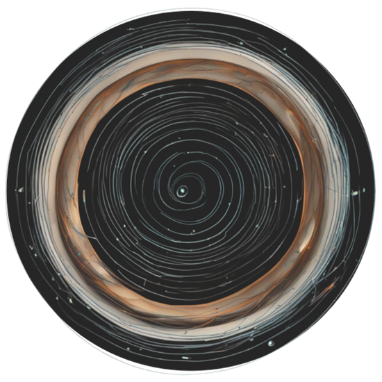
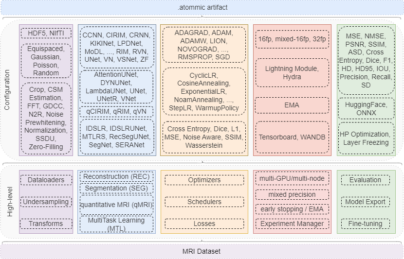

.. raw:: html

    <div style="text-align: center;">
        <span style="font-size:24px;">

            <a href="https://papers.ssrn.com/sol3/papers.cfm?abstract_id=4801289">📜</a>
            <a href="https://huggingface.co/wdika">🤗</a>
            <a href="https://docker.io/wdika/atommic">🐳</a>
            <a href="https://pypi.org/project/atommic">📦</a>
            <a href="https://atommic.readthedocs.io/">📚</a>

        </span>
    </div>

.. # define a hard line break for html
.. |br| raw:: html

    <br />

.. _dummy_header:


Introduction
============

.. # define a hard line break for html
.. |br| raw:: html

    <br />

.. _dummy_header:

The `Advanced Toolbox for Multitask Medical Imaging Consistency (ATOMMIC) <https://github.com/wdika/atommic>`_, is a
toolbox for applying AI methods for ``accelerated MRI reconstruction (REC)``, ``MRI segmentation (SEG)``,
``quantitative MR imaging (qMRI)``, as well as ``multitask learning (MTL)``, i.e., performing multiple tasks simultaneously,
such as reconstruction and segmentation. Each task is implemented in a separate collection consisting of data loaders,
transformations, models, metrics, and losses. ``ATOMMIC`` is designed to be modular and extensible on new tasks, models, and datasets.
``ATOMMIC`` uses `PyTorch Lightning <https://www.pytorchlightning.ai/>`_ for feasible high-performance multi-GPU/multi-node mixed-precision training.



|br|

The schematic overview of ``ATOMMIC`` showcases the main components of the toolbox. First we need an
`MRI Dataset <intro.html#mri-datasets>`_ (e.g. ``CC359``). Next, we need to define the high-level parameters, such as the
`task and the model <https://atommic.readthedocs.io/en/latest/mri/collections.html>`_, the
`undersampling <https://atommic.readthedocs.io/en/latest/mri/undersampling.html>`_, the
`transforms <https://atommic.readthedocs.io/en/latest/mri/transforms.html>`_, the
`optimizer <https://atommic.readthedocs.io/en/latest/core/core.html#optimization>`_, the
`scheduler <https://atommic.readthedocs.io/en/latest/core/core.html#learning-rate-schedulers>`_, the
`loss <https://atommic.readthedocs.io/en/latest/mri/losses.html>`_, the
`trainer parameters <https://atommic.readthedocs.io/en/latest/core/core.html#training>`_, and the
`experiment manager <https://atommic.readthedocs.io/en/latest/core/exp_manager.html>`_.
All these parameters are defined in a ``.yaml`` file using `Hydra <https://hydra.cc/>`_ and `OmegaConf <https://omegaconf.readthedocs.io/>`_.

The trained model is an ``.atommic`` `module <.https://atommic.readthedocs.io/en/latest/core/export.html>`_,
exported with `ONNX <https://onnx.ai/>`_ and `TorchScript <https://pytorch.org/docs/stable/jit.html>`_ support, which
can be used for inference. The ``.atommic`` module can also be uploaded on `HuggingFace <https://huggingface.co/>`_.
Pretrained models are available on our `HF <https://huggingface.co/wdika>`_ account and can be downloaded and used for
inference.

Installation
------------

``ATOMMIC`` is best to be installed in a Conda environment.

Conda
~~~~~

.. code-block:: bash

    conda create -n atommic python=3.10
    conda activate atommic

Pip
~~~
Use this installation mode if you want the latest released version.

.. code-block:: bash

    pip install atommic

From source
~~~~~~~~~~~
Use this installation mode if you are contributing to atommic.

.. code-block:: bash

    git clone https://github.com/wdika/atommic
    cd atommic
    ./reinstall.sh

Docker containers
~~~~~~~~~~~~~~~~~
An atommic container is available at dockerhub, you can pull it with:

.. code-block:: bash

    docker pull wdika/atommic

You can also build an atommic container with:

.. code-block:: bash

    DOCKER_BUILDKIT=1 docker build -f Dockerfile -t atommic:latest .

You can run the container with:

.. code-block:: bash

    docker run --gpus all -it --rm -v /home/user/configs:/config atommic:latest atommic run -c /config/config.yaml

where ```/config/config.yaml``` is the path to your local configuration file.

Or you can run it interactively with:

.. code-block:: bash

    docker run --gpus all -it --rm -p 8888:8888 atommic:latest /bin/bash -c "./start-jupyter.sh"


Quick Start Guide
-----------------

The best way to get started with ATOMMIC is with one of the `tutorials <(https://atommic.readthedocs.io/en/latest/starthere/tutorials.html>`_:

* `ATOMMIC Primer <https://github.com/wdika/atommic/blob/main/tutorials/00_ATOMMIC_Primer.ipynb>`__ - demonstrates how to use ATOMMIC.
* `ATOMMIC MRI transforms <https://github.com/wdika/atommic/blob/main/tutorials/01_ATOMMIC_MRI_transforms.ipynb>`__ - demonstrates how to use ATOMMIC to undersample MRI data.
* `ATOMMIC MRI undersampling <https://github.com/wdika/atommic/blob/main/tutorials/02_ATOMMIC_MRI_undersampling.ipynb>`__ - demonstrates how to use ATOMMIC to apply transforms to MRI data.
* `ATOMMIC Upload Model on HuggingFace <https://github.com/wdika/atommic/blob/main/tutorials/03_ATOMMIC_Upload_Model_On_HF.ipynb>`__ - demonstrates how to upload a model on HuggingFace.

You can also check the `projects <https://github.com/wdika/atommic/tree/main/projects>`_ page to see how to use ATOMMIC for specific tasks and public datasets.

Pre-trained models are available on HuggingFace `🤗 <https://huggingface.co/wdika>`_.

``ATOMMIC`` paper is fully reproducible. Please check `here <https://github.com/wdika/atommic/tree/main/projects/ATOMMIC_paper/README.md>`__  for more information.


Training & Testing
------------------

Training and testing models in ``ATOMMIC`` is intuitive and easy.  You just need to properly configure a ``.yaml`` file and run the following command:

.. code-block:: bash

    atommic run -c path-to-config-file


Configuration
~~~~~~~~~~~~~

#. Choose the ``task`` and the ``model``, according to the `collections <https://atommic.readthedocs.io/en/latest/mri/collections.html>`_.

#. Choose the ``dataset`` and the ``dataset parameters``, according to the `datasets <#mri-datasets>`_.

#. Choose the `undersampling <https://atommic.readthedocs.io/en/latest/mri/transforms.html>`_.

#. Choose the `transforms <https://atommic.readthedocs.io/en/latest/mri/transforms.html>`_.

#. Choose the `losses <https://atommic.readthedocs.io/en/latest/mri/losses.html>`_.

#. Choose the `optimizer <https://atommic.readthedocs.io/en/latest/core/core.html#optimization>`_.

#. Choose the `scheduler <https://atommic.readthedocs.io/en/latest/core/core.html#learning-rate-schedulers>`_.

#. Choose the `trainer parameters <https://atommic.readthedocs.io/en/latest/core/core.html#training>`_.

#. Choose the `experiment manager <https://atommic.readthedocs.io/en/latest/core/exp_manager.html>`_.

You can also check the `projects <https://github.com/wdika/atommic/tree/main/projects>`_ page to see how to configure the ``.yaml`` file for specific tasks.


Collections
-----------

``ATOMMIC`` is organized in `collections <https://atommic.readthedocs.io/en/latest/mri/collections.html>`_,, each of which implements a specific task. The following collections are currently available, implementing various models as listed:

``MultiTask Learning (MTL)``: 1. End-to-End Recurrent Attention Network (:class:`~atommic.collections.multitask.rs.nn.seranet.SERANet`), 2. Image domain Deep Structured Low-Rank Network (:class:`~atommic.collections.multitask.rs.nn.idslr.IDSLR`), 3. Image domain Deep Structured Low-Rank UNet (:class:`~atommic.collections.multitask.rs.nn.idslr_unet.IDSLRUNet`), 4. Multi-Task Learning for MRI Reconstruction and Segmentation (:class:`~atommic.collections.multitask.rs.nn.mtlrs.MTLRS`), 5. Reconstruction Segmentation method using UNet (:class:`~atommic.collections.multitask.rs.nn.recseg_unet.RecSegUNet`), 6. Segmentation Network MRI (:class:`~atommic.collections.multitask.rs.nn.segnet.SegNet`).

``quantitative MR Imaging (qMRI)``: 1. quantitative Recurrent Inference Machines (:class:`~atommic.collections.quantitative.nn.qrim_base.qrim_block.qRIMBlock`), 2. quantitative End-to-End Variational Network (:class:`~atommic.collections.quantitative.nn.qvarnet.qVarNet`), 3. quantitative Cascades of Independently Recurrent Inference Machines (:class:`~atommic.collections.quantitative.nn.qcirim.qCIRIM`).

``MRI Reconstruction (REC)``: 1. Cascades of Independently Recurrent Inference Machines (:class:`~atommic.collections.reconstruction.nn.cirim.CIRIM`), 2. Convolutional Recurrent Neural Networks (:class:`~atommic.collections.reconstruction.nn.crnn.CRNNet`), 3. Deep Cascade of Convolutional Neural Networks (:class:`~atommic.collections.reconstruction.nn.ccnn.CascadeNet`), 4. Down-Up Net (:class:`~atommic.collections.reconstruction.nn.dunet.DUNet`), 5. End-to-End Variational Network (:class:`~atommic.collections.reconstruction.nn.varnet.VarNet`), 6. Independently Recurrent Inference Machines (:class:`~atommic.collections.reconstruction.nn.rim_base.rim_block.RIMBlock`), 7. Joint Deep Model-Based MR Image and Coil Sensitivity Reconstruction Network (:class:`~atommic.collections.reconstruction.nn.jointicnet.JointICNet`), 8. :class:`~atommic.collections.reconstruction.nn.kikinet.KIKINet`, 9. Learned Primal-Dual Net (:class:`~atommic.collections.reconstruction.nn.lpd.LPDNet`), 10. Model-based Deep Learning Reconstruction (:class:`~atommic.collections.reconstruction.nn.modl.MoDL`), 11. :class:`~atommic.collections.reconstruction.nn.multidomainnet.MultiDomainNet`, 12. :class:`~atommic.collections.reconstruction.nn.proximal_gradient.ProximalGradient`, 13. Recurrent Inference Machines (:class:`~atommic.collections.reconstruction.nn.rim_base.rim_block.RIMBlock`), 14. Recurrent Variational Network (:class:`~atommic.collections.reconstruction.nn.recurrentvarnet.RecurrentVarNet`), 15. :class:`~atommic.collections.reconstruction.nn.unet.UNet`, 16. Variable Splitting Network (:class:`~atommic.collections.reconstruction.nn.vsnet.VSNet`), 17. :class:`~atommic.collections.reconstruction.nn.xpdnet.XPDNet`, 18. Zero-Filled reconstruction (:class:`~atommic.collections.reconstruction.nn.zf.ZF`).

``MRI Segmentation (SEG)``: 1. :class:`~atommic.collections.segmentation.nn.attentionunet.SegmentationAttentionUNet`, 2. :class:`~atommic.collections.segmentation.nn.dynunet.SegmentationDYNUNet`, 3. :class:`~atommic.collections.segmentation.nn.lambdaunet.SegmentationLambdaUNet`, 4. :class:`~atommic.collections.segmentation.nn.unet.SegmentationUNet`, 5. :class:`~atommic.collections.segmentation.nn.unet3d.Segmentation3DUNet`, 6. :class:`~atommic.collections.segmentation.nn.unetr.SegmentationUNetR`, 7. :class:`~atommic.collections.segmentation.nn.vnet.SegmentationVNet`.


MRI Datasets
------------

``ATOMMIC`` supports public datasets, as well as private datasets. The following public datasets are supported natively:

* `AHEAD <ttps://github.com/wdika/atommic/tree/main/projects/qMRI/AHEAD>`_: Supports the ``(qMRI)`` and ``(REC)`` tasks.
* `BraTS 2023 Adult Glioma <https://github.com/wdika/atommic/tree/main/projects/SEG/BraTS2023AdultGlioma>`_: Supports the ``(SEG)`` task.
* `CC359 <https://github.com/wdika/atommic/tree/main/projects/REC/CC359>`_: Supports the ``(REC)`` task.
* `fastMRI Brains Multicoil <https://github.com/wdika/atommic/tree/main/projects/REC/fastMRIBrainsMulticoil>`_: Supports the ``(REC)`` task.
* `fastMRI Knees Multicoil <https://github.com/wdika/atommic/tree/main/projects/REC/fastMRIKneesMulticoil>`_: Supports the ``(REC)`` task.
* `fastMRI Knees Singlecoil <https://github.com/wdika/atommic/tree/main/projects/REC/fastMRIKneesSinglecoil>`_: Supports the ``(REC)`` task.
* `ISLES 2022 Sub Acute Stroke <https://github.com/wdika/atommic/tree/main/projects/SEG/ISLES2022SubAcuteStroke>`_: Supports the ``(SEG)`` task.
* `SKM-TEA <https://github.com/wdika/atommic/tree/main/projects/MTL/rs/SKMTEA>`_: Supports the ``(REC)``, ``(SEG)``, and ``(MTL)`` tasks.
* `Stanford Knees <https://github.com/wdika/atommic/tree/main/projects/REC/StanfordKnees2019>`_: Supports the ``(REC)`` task.


License
-------

ATOMMIC is under `Apache 2.0 license <https://github.com/wdika/atommic/blob/main/LICENSE>`_.


Citation
---------

If you use ATOMMIC in your research, please cite as follows:

`@article{Karkalousos_2024,
   title={Atommic: An Advanced Toolbox for Multitask Medical Imaging Consistency to Facilitate Artificial Intelligence Applications from Acquisition to Analysis in Magnetic Resonance Imaging},
   url={http://dx.doi.org/10.2139/ssrn.4801289},
   DOI={10.2139/ssrn.4801289},
   publisher={Elsevier BV},
   author={Karkalousos, Dimitrios and Išgum, Ivana and Marquering, Henk and Caan, Matthan  W.A.},
   year={2024}}`


References
----------
ATOMMIC has been used or is referenced in the following papers:

#. Karkalousos, Dimitrios and Išgum, Ivana and Marquering, Henk and Caan, Matthan W.A., Atommic: An Advanced Toolbox for Multitask Medical Imaging Consistency to Facilitate Artificial Intelligence Applications from Acquisition to Analysis in Magnetic Resonance Imaging. Available at SSRN: https://ssrn.com/abstract=4801289 or http://dx.doi.org/10.2139/ssrn.4801289

#. Karkalousos, D., Išgum, I., Marquering, H. A., & Caan, M. W. A. (2024). ATOMMIC: An Advanced Toolbox for Multitask Medical Imaging Consistency to facilitate Artificial Intelligence applications from acquisition to analysis in Magnetic Resonance Imaging. https://doi.org/10.2139/ssrn.4801289

#. Karkalousos, D., Isgum, I., Marquering, H., & Caan, M. W. A. (2024, April 27). The Advanced Toolbox for Multitask Medical Imaging Consistency (ATOMMIC): A Deep Learning framework to facilitate Magnetic Resonance Imaging. Medical Imaging with Deep Learning. https://openreview.net/forum?id=HxTZr9yA0N

#. Karkalousos, D., Isgum, I., Marquering, H. &amp; Caan, M.W.A.. (2024). MultiTask Learning for accelerated-MRI Reconstruction and Segmentation of Brain Lesions in Multiple Sclerosis. <i>Medical Imaging with Deep Learning</i>, in <i>Proceedings of Machine Learning Research</i> 227:991-1005 Available from https://proceedings.mlr.press/v227/karkalousos24a.html.

#. Zhang, C., Karkalousos, D., Bazin, P. L., Coolen, B. F., Vrenken, H., Sonke, J. J., Forstmann, B. U., Poot, D. H. J., & Caan, M. W. A. (2022). A unified model for reconstruction and R2* mapping of accelerated 7T data using the quantitative recurrent inference machine. NeuroImage, 264. [DOI](https://doi.org/10.1016/j.neuroimage.2022.119680)

#. Karkalousos, D., Noteboom, S., Hulst, H. E., Vos, F. M., & Caan, M. W. A. (2022). Assessment of data consistency through cascades of independently recurrent inference machines for fast and robust accelerated MRI reconstruction. Physics in Medicine & Biology. [DOI](https://doi.org/10.1088/1361-6560/AC6CC2)


Contact
-------
For any questions, please contact Dimitris Karkalousos @ `d.karkalousos@amsterdamumc.nl`.


Disclaimer & Acknowledgements
-----------------------------

.. note::
    ATOMMIC is built on top of `NeMo <https://github.com/NVIDIA/NeMo>`_. NeMo is under Apache 2.0 license, so we are allowed to use it.
    We also assume that we can use the NeMo documentation basis as long as we cite it and always refer to the baselines everywhere in the code and docs.
    ATOMMIC also includes implementations of reconstruction methods from `fastMRI <https://github.com/facebookresearch/fastMRI>`_ and
    `DIRECT <https://github.com/NKI-AI/direct>`_, and segmentation methods from `MONAI <https://github.com/Project-MONAI/MONAI>`_, as well as other codebases
    which as always cited on the corresponding files. All methods in ATOMMIC are reimplemented and not called from the original libraries, allowing for full
    reproducibility, support, and easy extension. ATOMMIC is an open-source project under the Apache 2.0 license.
